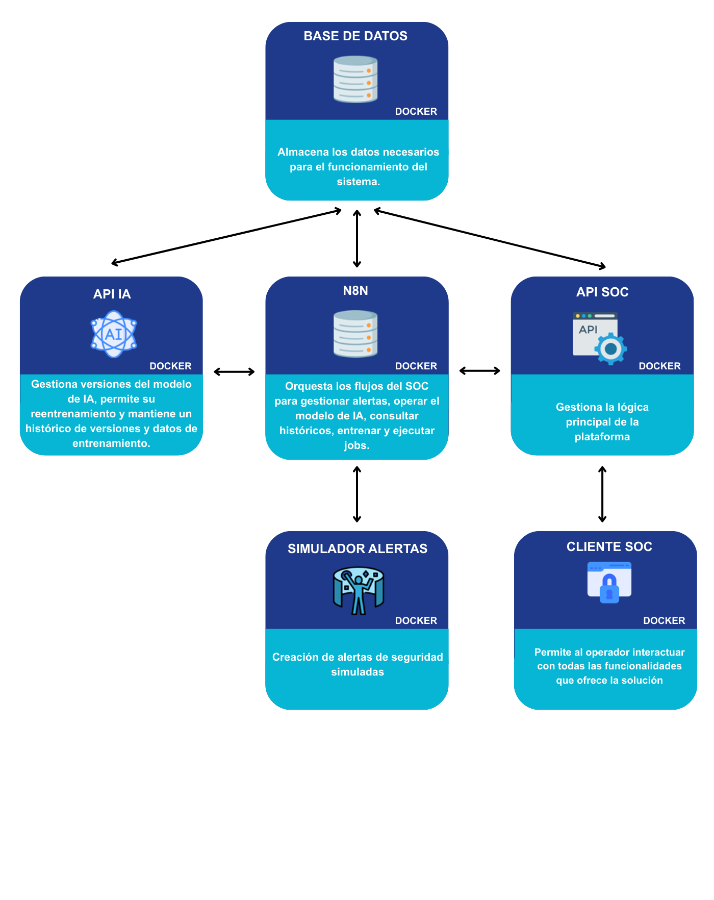
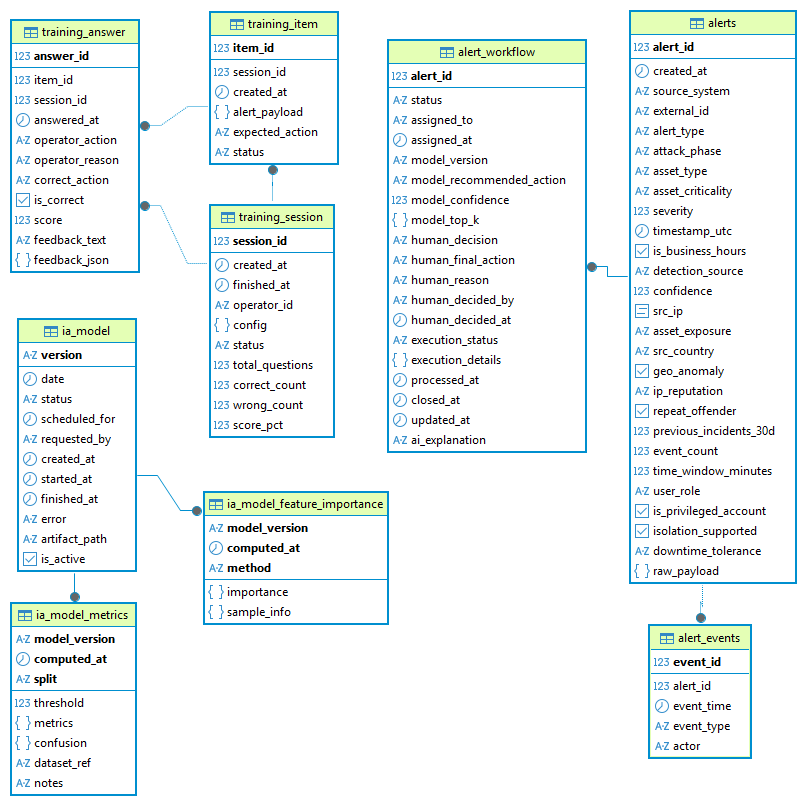
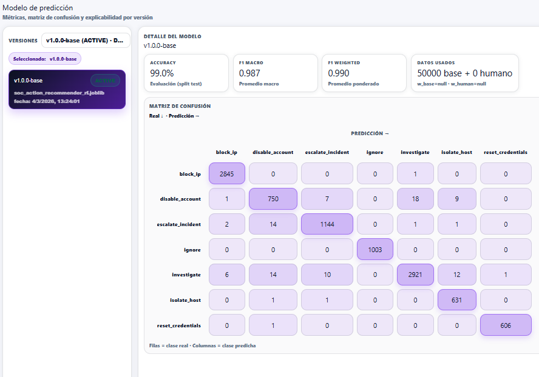
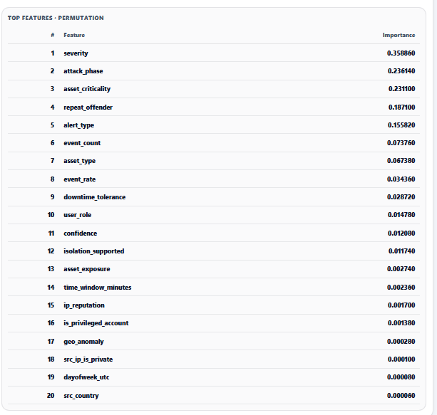
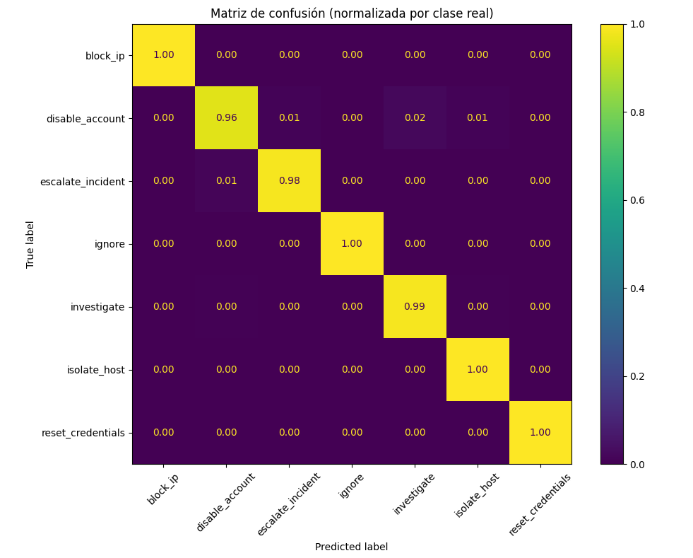

# AI-Assisted SOC — Security Operations Center with ML recommendations, LLM agents and continuous learning

Master's thesis project, MSc in AI Applied to Cybersecurity (International Cybersecurity Campus & UCAM, 2026).

A working prototype of a Security Operations Center where every incoming alert is registered, assigned to the right operator and enriched with a recommended response action, all automatically. The operator keeps the final decision (human-in-the-loop), every decision is stored, and the model can be retrained from real operator decisions directly from the console. A training module lets junior analysts practise on simulated incidents with an LLM acting as senior instructor.

Everything runs locally with Docker Compose and a local LLM through Ollama. No external APIs, no cost.



## What it does

1. **Alert intake.** A simulator generates security alerts with realistic context: alert type, severity, attack phase, affected asset and its criticality, IP reputation, repeat offender, event count, business hours, and more (30+ fields).
2. **Automated triage (n8n, `Process Alert`).** The alert is registered, the ML API returns the top-K recommended actions with confidence, and an LLM agent (Llama 3.2 via Ollama, with PostgreSQL tools) assigns the best available operator based on specialisation, shift and workload. The agent is constrained to a pre-filtered list of valid candidates and must answer in JSON; deterministic fallback filters (by phase, alert type, severity) run if the agent fails. Average time from alert to assignment: **~15 seconds**.
3. **Operator console (React).** The operator sees the queue in real time (WebSocket over PostgreSQL `LISTEN/NOTIFY`), opens the alert, reviews the recommended actions, the playbook rules behind them and the events, and records a decision with a reason.
4. **Continuous learning.** Decisions are stored and can be selected from the console to retrain the model. New versions go into a model registry with their metrics; the active version is switched automatically. Each version exposes its metrics, confusion matrix and permutation feature importance in the console (explainability).
5. **Analyst training.** Practice sessions present historical alerts; the analyst decides, and an LLM "senior instructor" grades the decision against the model recommendation and explains the correct action. Scores are stored per session. Average time of the learning flow: **~6 seconds**.

## Architecture

| Service | Tech | Role |
|---|---|---|
| `soc-console-web` | React 18, Vite, WebSockets | Operator console: queue, alert detail, SOC status, history, models, training |
| `soc-console-api` | FastAPI, asyncpg | Alerts, decisions, playbook, operators and SLA, metrics, training sessions, model views (~30 endpoints) |
| `api-ml` | FastAPI, scikit-learn, pandas | `/predict`, `/retrain/run`, model registry and versioning |
| `api-sim` | FastAPI | Alert simulator |
| n8n 1.118 | Workflows | `Process Alert`, `Retrain Model`, `Training Explication`, `UpdateOperatorsShift` |
| Ollama | Llama 3.2 | Operator-assignment agent and training instructor |
| PostgreSQL 16 | | Alerts, workflow state, decisions, operators, training sessions, model registry |

Database schema:



## The ML model

- **Task:** recommend the response action for an alert (7 classes: `block_ip`, `disable_account`, `escalate_incident`, `ignore`, `investigate`, `isolate_host`, `reset_credentials`). The model does not detect threats; it assumes the alert was already raised by a SIEM/EDR and helps decide what to do.
- **Data:** a synthetic dataset of 50,000 records generated from rule-based SOC response policies, with controlled noise and class balancing to avoid a fully deterministic mapping. Test set: 10,000 independent records.
- **Algorithm:** Random Forest (chosen over single decision trees for robustness and lower overfitting).
- **Explainability:** permutation feature importance per model version, shown in the console. The top drivers are `severity`, `attack_phase`, `asset_criticality`, `repeat_offender` and `alert_type`.
- **Retraining:** operator decisions are weighted higher than base data so the model adapts progressively to real operations.

### Results (test set, 10,000 records)

| Metric | Value |
|---|---|
| Accuracy | **0.990** |
| F1 macro | **0.987** |
| F1 weighted | **0.990** |

Per-class precision / recall / F1 are all above 0.95 (`disable_account` is the weakest at 0.96 / 0.96 / 0.96; `ignore`, `block_ip` and `reset_credentials` are ≥ 0.99).







## Where the LLM is used, and where it is not

The LLM is only used where it adds clear value: assigning operators with reasoning over context, and generating explanations for analysts. Everything deterministic or repetitive (registration, status updates, filters, retraining) is handled with rules, SQL and code. This hybrid approach keeps the flow fast and predictable; local models like Llama 3.2 are noticeably weaker than commercial ones, so they are kept away from decisions that must be exact.

## Limitations and future work

- Alerts and the training dataset are synthetic; this is a functional prototype, not a production SOC.
- Local LLM quality limits the explanations; a stronger model would improve them.
- Next steps: replace the simulator with real SIEM/EDR input, stress-test with many concurrent operators, and evaluate more capable models.
- The one-shot launcher is Windows-only. On macOS/Linux, run the Python scripts and `docker compose` manually (see below).
- Credentials are hard-coded for a local demo environment.

## Repository layout

```
IA Model/            dataset generation, exploration and offline training scripts
Dockers/
  compose.yml        full environment
  api-ml/            ML API: predict, retrain, model registry
  api-sim/           alert simulator
  soc-console-api/   console API
  soc-console-web/   React console
  flows/             n8n workflows (JSON)
  db-init/           PostgreSQL schema, triggers (LISTEN/NOTIFY) and seed operators
DOCS/                thesis, technical document, dataset analysis, functional guide (Spanish)
DOCS/img/            figures used in this README
launcher.py          one-shot deployment script (Windows)
```

---

# Installation

## Requirements

- **Docker Desktop**, installed and running: https://www.docker.com/products/docker-desktop/
- **Ollama**: https://ollama.com
- Python 3 (only for the manual path)

## Quick start (Windows)

Download `launcher.exe` from the [Releases](../../releases) page and run it. It will:

1. Generate the training dataset
2. Train the machine learning model
3. Copy the model and dataset into the ML service
4. Build all Docker containers
5. Deploy the full infrastructure
6. Import the n8n workflows
7. Start all services

Then complete the **Post-deployment configuration** below.

## Manual deployment (macOS / Linux / if the launcher fails)

### 1. Generate the dataset and train the model

```
cd "IA Model"
python GenerateDataset.py
python DatasetTraining.py
```

This produces `soc_action_recommender_rf.joblib` and `soc_dataset.csv`.

### 2. Copy the artifacts into the ML service

```
soc_action_recommender_rf.joblib  ->  Dockers/api-ml/
soc_dataset.csv                   ->  Dockers/api-ml/train/
```

### 3. Start the environment

```
cd Dockers
docker compose up -d --build
```

### 4. Import the n8n workflows

Open http://localhost:5678 and import the JSON files in `Dockers/flows`.

## Post-deployment configuration

### Ollama

Ollama must be running before the workflows execute.

```
ollama serve
ollama pull llama3.2
```

Credentials are not imported with the workflows, so create an **Ollama** credential in n8n (Credentials → Create → Ollama) with base URL:

```
http://host.docker.internal:11434
```

and assign it to the Ollama nodes.

### PostgreSQL

Create a **PostgreSQL** credential in n8n with:

```
Host: postgres
Port: 5432
Database: socdb
User: soc
Password: socpass
```

and assign it to all PostgreSQL nodes. Without it the workflows fail with `Credential with ID "..." does not exist for type "postgres"`.

### Activate the workflows

Activate **Process Alert**, **Retrain Model**, **Training Explication** and **UpdateOperatorsShift**. Leave **CreateAlarm** disabled.

### Register the base model (needed for explainability)

The first model must be registered manually so the console can show its metrics and feature importance. Later versions produced by retraining are registered automatically.

```
cd Dockers/api-ml/app/scripts
export PG_HOST=localhost PG_PORT=5432 PG_DB=socdb PG_USER=soc PG_PASS=socpass   # Windows: use `set`
python register_joblib_metrics.py \
  --joblib soc_action_recommender_rf.joblib \
  --version v1.0.0 \
  --dataset train/soc_dataset.csv \
  --artifact-path soc_action_recommender_rf.joblib \
  --set-active
```

| Parameter | Meaning |
|---|---|
| `--joblib` | Trained model file |
| `--version` | Version identifier |
| `--dataset` | Training dataset, stored for traceability |
| `--artifact-path` | Path stored in the registry |
| `--set-active` | Mark this version as the one used for predictions |

## Services

| Service | URL |
|---|---|
| SOC console | http://localhost:5173 |
| n8n | http://localhost:5678 |
| Console API | http://localhost:7000 |
| ML API | http://localhost:8000 |
| Alert simulator | http://localhost:9000 |

## License

MIT. See `LICENSE`.
